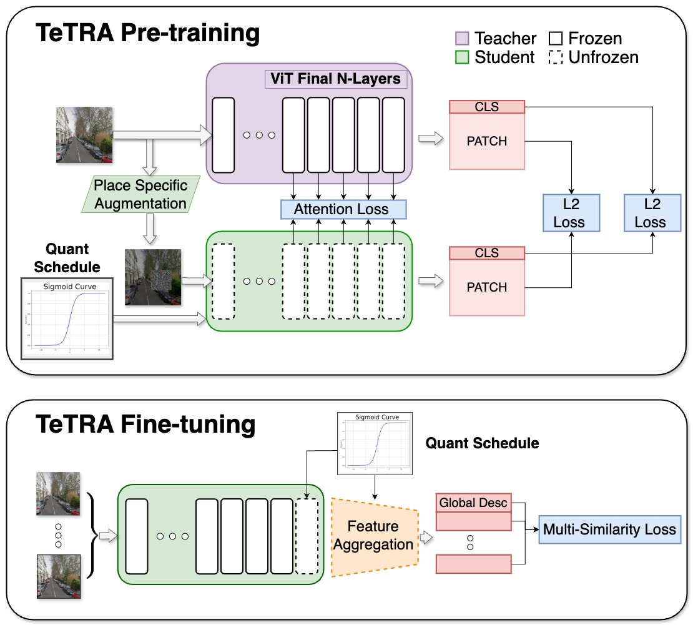

# TeTRA‑VPR: Ternary Transformer for Efficient Visual Place Recognition

Welcome to the official codebase that accompanies the paper **“TeTRA‑VPR: A Ternary Transformer Approach for Compact Visual Place Recognition”** (ICRA 2025, pre‑print arXiv:2503.02511). This repository provides everything you need to reproduce the two‑stage training pipeline—**progressive distillation pre‑training** and **supervised fine‑tuning**—as well as scripts for evaluation and inference on common VPR benchmarks.

---

## Visual Abstract

<p align="center">
  
</p>

---

## Table of Contents

1. [Key Features](#key-features)
2. [Requirements & Installation](#requirements--installation)
3. [Repository Structure](#repository-structure)
4. [Datasets](#datasets)
5. [Configuration System](#configuration-system)
6. [Stage 1 – Progressive Distillation Pre‑Training](#stage-1--progressive-distillation-pre-training)
7. [Stage 2 – Supervised Fine‑Tuning](#stage-2--supervised-fine-tuning)
8. [Evaluation & Inference](#evaluation--inference)
9. [Pre‑Trained Checkpoints](#pre-trained-checkpoints)
10. [Reproducing the Paper](#reproducing-the-paper)
11. [Citation](#citation)
12. [License](#license)
13. [Contact](#contact)

---

## Key Features

* **Ultra‑low‑bit ViT backbone** – weights quantised to **2‑bit ternary** precision; final embeddings **1‑bit binary**.
* **Progressive Quantisation‑Aware Training** – smooth sigmoid schedule for stable convergence (Eq. 9 / 10 in the paper).
* **Multi‑level Distillation Loss** – aligns classification tokens, patch tokens and attention maps to a DinoV2‑BoQ teacher.
* **Plug‑and‑Play Aggregation** – choose between **BoQ**, **SALAD**, **MixVPR** or **GeM** via `--agg_arch`.
* **Turn‑key scripts** – `pretrain.py` and `finetune.py` reproduce all experiments with a single command.

---

## Requirements & Installation

All dependencies are pinned in **`requirements.txt`** (generated with [pip‑chill](https://github.com/acl21/pip-chill)). Install everything in one line:

```bash
python -m pip install -r requirements.txt
```

> **GPU:** All results were obtained on NVIDIA H100 (80 GB, SM90). Training also fits on ≥24 GB GPUs (A6000, 4090) with `--accumulate_grad_batches` set appropriately.

---

## Repository Structure

```text
├── config.py               # Dataclass definitions: ModelConfig, DistillConfig, TeTRAConfig
├── pretrain.py             # Stage 1 – progressive ternary distillation
├── finetune.py             # Stage 2 – supervised binary fine‑tuning
├── dataloaders/            # Data loaders for pretrain.py and finetune.py
├── models/                 # ViT backbone, quantisation ops, aggregation heads
└── README.md               # You are here 🚀
```

---

## Datasets

> **License notice:** Check the terms for each dataset—some require explicit attribution or restrict redistribution.

### 1. Unlabelled distillation data. 

* **San Francisco XL** panoramas \[[application form](https://github.com/gmberton/CosPlace?tab=readme-ov-file)] 

Place the raw JPEGs under a single root folder, e.g.:

```text
/data/vpr_datasets/sf_xl
```

### 2. Supervised fine‑tuning & validation

* **GSV‑Cities** – used for finetuning (download from \[[Kaggle](https://www.kaggle.com/datasets/amaralibey/gsv-cities)])
* **MSLS** – used for validation during fine‑tuning – official download \[[Mapillary Places](https://www.mapillary.com/dataset/places)] and the script for formatting it can be found here \[[VPR‑datasets‑downloader](https://github.com/gmberton/VPR-datasets-downloader)].

### Required directory layout

To reproduce the paper's results, organise your datasets as follows:

````text
/path/to/vpr_datasets/msls/...        # (formatted for VPR)
/path/to/vpr_datasets/gsv-cities/...
/path/to/vpr_datasets/sf_xl/raw/panoramas/...
````


---

## Configuration System

All hyper‑parameters are defined in three `@dataclass` objects inside **`configs.py`**:

* **`ModelConfig`** – backbone & aggregation architecture, descriptor normalisation.
* **`DistillConfig`** – learning rate, batch size, augmentation level, etc. for **pre‑training**.
* **`TeTRAConfig`** – hyper‑parameters for **fine‑tuning**, freezing policy, quant schedule.

Every field can be overridden from the CLI, e.g. `--batch_size 256`. Run `python pretrain.py --help` for a complete list.

---

## Stage 1 – Progressive Distillation Pre‑Training

Train the ternary ViT backbone from scratch using unlabeled images.

```bash
python pretrain.py \
  --train_dataset_dir /path/to/sf_xl/raw/panoramas/ \
  --backbone_arch ternaryvitbase \
  --agg_arch boq \
  --lr 4e-4 \
  --batch_size 128 \
  --accumulate_grad_batches 2 \
  --max_epochs 30 \
  --weight_decay 0.01 \
  --use_attn_loss True \
  --precision bf16-mixed
```

Outputs:

* `./checkpoints/model_name/**step=N-train_loss=M-qfactor-1.0.ckpt` – lightning checkpoint
    - here qfactor, refers to the progressive quantization factor (read the paper for more info)

⚠️ **Tips**

* Mixed precision speeds up training by \~30 % on Ampere and newer GPUs.
* Uncomment DDPStrategy in pretrain.py if in multi-gpu environment. 

---

## Stage 2 – Supervised Fine‑Tuning

Fine‑tune aggregation head + final ViT block using place labels.

```bash
python finetune.py \
  --pretrain_checkpoint ./checkpoints/pretrain_epoch=29.ckpt \
  --train_dataset_dir /path/to/gsv-cities \
  --val_dataset_dir   /path/to/vpr_datasets/ # msls should be inside here \
  --agg_arch boq \
  --quant_schedule logistic \
  --freeze_backbone True \
  --freeze_all_except_last_n 1 \
  --lr 1e-4 \
  --batch_size 200 \
  --max_epochs 40 \
  --precision bf16-mixed
```

Outputs:

* `./checkpoints/model_name/epoch=N-MSLS_binary_R1=***.ckpt` – final binary‑embedding model (≈ 49 MB).
    - `MSLS_binary_R1` in the path records the recall@1 on msls validation set, with binary descriptors

---

## Pre‑Trained Checkpoints

| Model        | Aggregation | Descriptor Dim | R\@1 (Tokyo247) | Size  | Link                                              |
| ------------ | ----------- | -------------- | --------------- | ----- | ------------------------------------------------- |
| TeTRA‑BoQ    | BoQ         | 1024 (binary)  | **88.6 %**      | 49 MB | [download](https://example.com/tetra_boQ.ckpt)    |
| TeTRA‑SALAD  | SALAD       | 256 (binary)   | 85.4 %          | 45 MB | [download](https://example.com/tetra_salad.ckpt)  |
| TeTRA‑MixVPR | MixVPR      | 512 (binary)   | 82.5 %          | 46 MB | [download](https://example.com/tetra_mixvpr.ckpt) |

---

## Reproducing the Paper
use these two pything scripts. The default configs, will reproduce the TeTRA-BoQ result, with a logistic 
quantization schedule. Change the defaults in the cli to experiment further with TeTRA.

```bash
python pretrain.py 
python finetune.py --pretrain_checkpoint /path/to/pretrain_checkpoint.ckpt
````

> **Expected pretraining hardware:** 4× H100 80GB for pretraining (gradient accumulation=2) using the DDP distribution strategy.
> **Expected finetuning hardward:** 1x H100 80GB for finetuning. 

similar results can be achieved with less training and smaller models. Try the `--backbone_arch ternaryvitsmall` for faster training. 

---

## Citation

If you use this codebase or the pretrained models, please cite:

```bibtex
@misc{grainge2025tetravpr,
      title={TeTRA-VPR: A Ternary Transformer Approach for Compact Visual Place Recognition}, 
      author={Oliver Grainge and Michael Milford and Indu Bodala and Sarvapali D. Ramchurn and Shoaib Ehsan},
      year={2025},
      eprint={2503.02511},
      archivePrefix={arXiv},
      primaryClass={cs.CV},
      url={https://arxiv.org/abs/2503.02511}, 
}
```

---

## License

This project is released under the **MIT License**. See [`LICENSE`](LICENSE) for details.

---

## Contact

* **Ollie Grainge** – [oeg1n18@soton.ac.uk](mailto:oeg1n18@soton.ac.uk)
* Pull requests are welcome! Open an issue for feature requests or bug reports.

> *“A place is worth a bag of ternary queries.”*  – TeTRA motto 🛰️🚀
